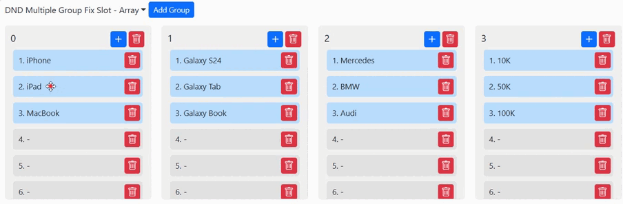
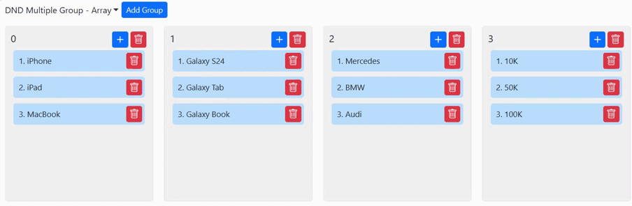

# React HTML Drag and Drop Demo (No third party library)

This repository contains a React application that demonstrates the capabilities of HTML's drag and drop API. The application allows users to reorder or relocate the items on the same or different containers by interactively drag and drop. No third party library is needed.




## Live Demo
<https://react-html-dnd.vercel.app/multipleGroupArray>

## Features

- **Draggable Elements**: Users can click and drag the element within the same container, or across different container, so that to reorder, or relocat them.
- **Data Type**: This repository includes the examples of using Object and 2D array.
- **DND Behavior**: Slot must be emptied before putting element/Items can be inserted between the elements.
- **Add/Delete Container**: Allows add or delete container.
- **Add/Delete Item**: Allows add or delete items within container.
- **Responsive**: Responsive layout to enable usability on mobile devices.

## Getting Started

These instructions will get you a copy of the project up and running on your local machine for development and testing purposes.

### Prerequisites

Before you begin, ensure you have the following installed:
- Node.js (>=18.x)
- npm (or yarn)
- A modern web browser that supports HTML5 and ES6+.

### Installation

Clone the repository to your local machine:

```bash
git clone https://github.com/drive2mobile/react_html_dnd.git
cd react_html_dnd
```

Install the necessary dependencies:

```bash
npm install
```

To run the application in development mode, execute:
```bash
npm start
```
